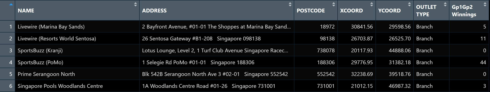
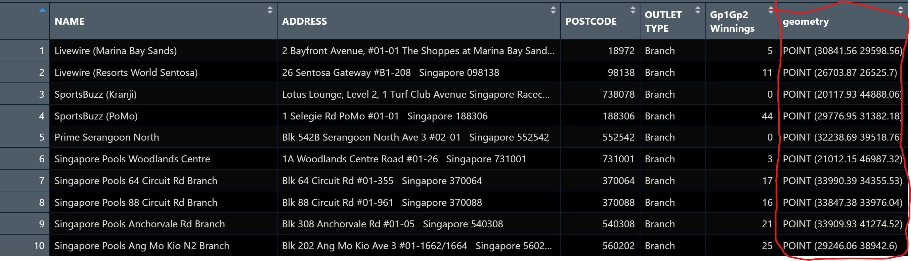

# Proportional Symbol Mapping with R

Proportional symbol maps (also known as graduate symbol maps) are a class of maps that use the visual variable of size to represent differences in the magnitude of a discrete, abruptly changing phenomenon, e.g. counts of people. Like choropleth maps, you can create classed or unclassed versions of these maps. The classed ones are known as range-graded or graduated symbols, and the unclassed are called proportional symbols, where the area of the symbols are proportional to the values of the attribute being mapped. In this hands-on exercise, you will learn how to create a proportional symbol map showing the number of wins by Singapore Pools' outlets using an R package called **tmap**.

Proportional symbol maps use symbol size to show magnitude (e.g. counts). Symbols can be classed (range-graded) or unclassed (area ∝ value). This exercise uses **tmap** to make a proportional symbol map of Singapore Pools outlets (e.g. by winnings).

### 1.1 Learning outcome

-   To import an aspatial data file into R.
-   To convert it into simple point feature data frame and at the same time, to assign an appropriate projection reference to the newly create simple point feature data frame.
-   To plot interactive proportional symbol maps.

## 2 Getting Started

Install and load **tmap**, **sf**, **tidyverse**:

```{r}
pacman::p_load(sf, tmap, tidyverse)
```

## 3 Geospatial Data Wrangling

### 3.1 The data

*SGPools_svy21* (csv): seven columns; XCOORD and YCOORD are outlet coordinates in [Singapore SVY21](https://www.sla.gov.sg/sirent/CoordinateSystems.aspx).



### 3.2 Data Import and Preparation

Import the CSV with *read_csv()*:

```{r}
sgpools <- read_csv("data/aspatial/SGPools_svy21.csv")
```

Check the import with *list(sgpools)*. Result is a tibble.

```{r}
list(sgpools)
```

### 3.3 Creating a **sf** data frame from an aspatial data frame

Convert to sf with *st_as_sf()*: give *coords* (x, then y columns) and *crs* (e.g. 3414 for [SVY21](https://epsg.io/3414)).

```{r}
sgpools_sf <- st_as_sf(sgpools, 
                       coords = c("XCOORD", "YCOORD"),
                       crs= 3414)
```

A *geometry* column is added. Use *list(sgpools_sf)* to see: point geometry, epsg 3414, bbox.



```{r}
list(sgpools_sf)
```

## 4 Drawing Proportional Symbol Map

Use tmap view mode for interactive maps. Turn it on:

```{r}
tmap_mode("view")
```

### 4.1 It all started with an interactive point symbol map

Basic point map with *tm_bubbles()*:

```{r}
tm_shape(sgpools_sf) + 
  tm_bubbles(fill = "red",
           size = 1,
           col = "black",
           lwd = 1)
```

### 4.2 Lets make it proportional

Map a numeric variable to *size* (e.g. *Gp1Gp2 Winnings*):

```{r}
tm_shape(sgpools_sf) + 
  tm_bubbles(fill = "red",
             size = "Gp1Gp2 Winnings",
             col = "black",
             lwd = 1)
```

### 4.3 Lets give it a different colour

Map a variable to *fill* (e.g. *OUTLET TYPE*) to colour by category:

```{r}
tm_shape(sgpools_sf) + 
  tm_bubbles(fill = "OUTLET TYPE", 
             size = "Gp1Gp2 Winnings",
             col = "black",
             lwd = 1)
```

### 4.4 I have a twin brothers :)

*tm_facets(by = ..., sync = TRUE)* gives multiple maps with synced zoom and pan.

```{r}
tm_shape(sgpools_sf) + 
  tm_bubbles(fill = "OUTLET TYPE", 
             size = "Gp1Gp2 Winnings",
             col = "black",
             lwd = 1) + 
  tm_facets(by= "OUTLET TYPE",
            nrow = 1,
            sync = TRUE)
```

Switch back to plot mode when done:

```{r}
tmap_mode("plot")
```

## 5 Reference

### 5.1 All about **tmap** package

-   [tmap: Thematic Maps in R](https://www.jstatsoft.org/article/view/v084i06)
-   [tmap](https://cran.r-project.org/web/packages/tmap/index.html)
-   [tmap: get started!](https://cran.r-project.org/web/packages/tmap/vignettes/tmap-getstarted.html)
-   [tmap: changes in version 2.0](https://cran.r-project.org/web/packages/tmap/vignettes/tmap-changes-v2.html)
-   [tmap: creating thematic maps in a flexible way (useR!2015)](http://von-tijn.nl/tijn/research/presentations/tmap_user2015.pdf)
-   [Exploring and presenting maps with tmap (useR!2017)](http://von-tijn.nl/tijn/research/presentations/tmap_user2017.pdf)

### 5.2 Geospatial data wrangling

-   [sf: Simple Features for R](https://cran.r-project.org/web/packages/sf/index.html)
-   [Simple Features for R: StandardizedSupport for Spatial Vector Data](https://journal.r-project.org/archive/2018/RJ-2018-009/RJ-2018-009.pdf)
-   [Reading, Writing and Converting Simple Features](https://cran.r-project.org/web/packages/sf/vignettes/sf2.html)

### 5.3 Data wrangling

-   [dplyr](https://dplyr.tidyverse.org/)
-   [Tidy data](https://cran.r-project.org/web/packages/tidyr/vignettes/tidy-data.html)
-   [tidyr: Easily Tidy Data with 'spread()' and 'gather()' Functions](https://cran.r-project.org/web/packages/tidyr/tidyr.pdf)
