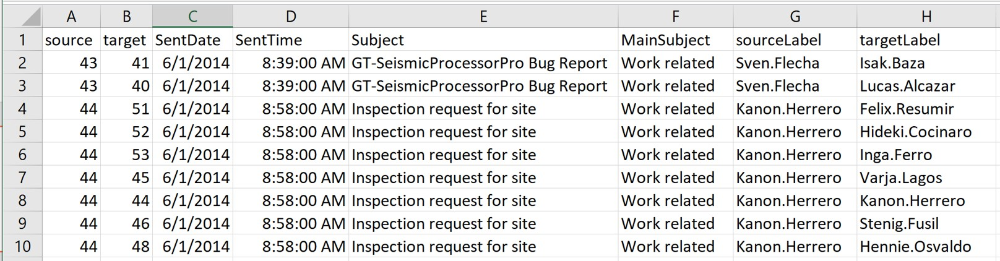
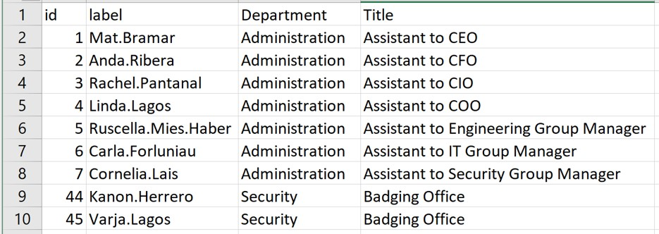

# Modelling, Visualising and Analysing Network Data with R

## 1 Overview

In this hands-on exercise, I learned how to model, analyse and visualise network data using R.

By the end of this hands-on exercise, I was able to:

-   create graph object data frames, manipulate them using appropriate functions of *dplyr*, *lubridate*, and *tidygraph*,
-   build network graph visualisation using appropriate functions of *ggraph*,
-   compute network geometrics using *tidygraph*,
-   build advanced graph visualisation by incorporating the network geometrics, and
-   build interactive network visualisation using *visNetwork* package.

## 2 Getting Started

### 2.1 Installing and launching R packages

I loaded four network data modelling and visualisation packages: **igraph**, **tidygraph**, **ggraph** and **visNetwork**. Beside these four packages, **tidyverse** and [**lubridate**](https://lubridate.tidyverse.org/), an R package specially designed to handle and wrangle time data, were also loaded. Additionally, **graphlayouts**, **concaveman** and **ggforce** were included to support advanced graph visualisation.

The code chunk:

```{r}
pacman::p_load(igraph, tidygraph, ggraph, 
               visNetwork, lubridate, clock,
               tidyverse, graphlayouts, 
               concaveman, ggforce)
```

## 3 The Data

The data sets used in this hands-on exercise is from an oil exploration and extraction company. There are two data sets. One contains the nodes data and the other contains the edges (also know as link) data.

### 3.1 The edges data

-   *GAStech-email_edges.csv* which consists of two weeks of 9063 emails correspondances between 55 employees.



### 3.2 The nodes data

-   *GAStech_email_nodes.csv* which consist of the names, department and title of the 55 employees.



### 3.3 Importing network data from files

In this step, I imported `GAStech_email_node.csv` and `GAStech_email_edges-v2.csv` into the RStudio environment using `read_csv()` of the **readr** package.

```{r}
GAStech_nodes <- read_csv("data/GAStech_email_node.csv")
GAStech_edges <- read_csv("data/GAStech_email_edge-v2.csv")
```

### 3.4 Reviewing the imported data

Next, I examined the structure of the data frame using *glimpse()* of **dplyr**.

```{r}
glimpse(GAStech_edges)
```

::: callout-warning
The output report of GAStech_edges above reveals that the *SentDate* is treated as "Character" data type instead of *date* data type. This is an error! Before we continue, it is important for us to change the data type of *SentDate* field back to "Date"" data type.
:::

### 3.5 Wrangling time

I used the code chunk below to perform the date type conversion.

```{r}
GAStech_edges <- GAStech_edges %>%
  mutate(SendDate = dmy(SentDate)) %>%
  mutate(Weekday = wday(SentDate,
                        label = TRUE,
                        abbr = FALSE))
```

::: callout-tip
## Things learned from the code chunk above

-   Both *dmy()* and *wday()* are functions of the **lubridate** package. [lubridate](https://cran.r-project.org/web/packages/lubridate/vignettes/lubridate.html) is an R package that makes it easier to work with dates and times.
-   *dmy()* transforms the SentDate to Date data type.
-   *wday()* returns the day of the week as a decimal number or an ordered factor if label is TRUE. The argument `abbr = FALSE` keeps the day spelled in full, i.e. Monday. The function creates a new column *Weekday* in the data frame.
-   The values in the *Weekday* field are in ordinal scale.
:::

### 3.6 Reviewing the revised date fields

The table below shows the data structure of the reformatted *GAStech_edges* data frame

```{r}
#| echo: false
glimpse(GAStech_edges)
```

### 3.7 Wrangling attributes

A close examination of *GAStech_edges* data.frame reveals that it consists of individual e-mail flow records. This is not very useful for visualisation.

In view of this, I aggregated the individual records by date, senders, receivers, main subject and day of the week.

The code chunk:

```{r}
GAStech_edges_aggregated <- GAStech_edges %>%
  filter(MainSubject == "Work related") %>%
  group_by(source, target, Weekday) %>%
    summarise(Weight = n()) %>%
  filter(source!=target) %>%
  filter(Weight > 1) %>%
  ungroup()
```

::: callout-tip
## Things learned from the code chunk above

-   Four functions from **dplyr** package are used: *filter()*, *group_by()*, *summarise()*, and *ungroup()*.
-   The output data frame is called **GAStech_edges_aggregated**.
-   A new field called *Weight* has been added in GAStech_edges_aggregated.
:::

### 3.8 Reviewing the revised edges file

The table below shows the data structure of the reformatted *GAStech_edges_aggregated* data frame

```{r}
#| echo: false
glimpse(GAStech_edges_aggregated)
```

## 4 Creating network objects using **tidygraph**

In this section, I learned how to create a graph data model using the **tidygraph** package. It provides a tidy API for graph/network manipulation. While network data itself is not tidy, it can be envisioned as two tidy tables — one for node data and one for edge data. **tidygraph** provides a way to switch between the two tables and exposes dplyr verbs for manipulating them, as well as access to a wide range of graph algorithms.

Before getting started, I referred to these two articles:

-   [Introducing tidygraph](https://www.data-imaginist.com/2017/introducing-tidygraph/)
-   [tidygraph 1.1 - A tidy hope](https://www.data-imaginist.com/2018/tidygraph-1-1-a-tidy-hope/)

### 4.1 The **tbl_graph** object

Two functions of **tidygraph** package can be used to create network objects:

-   [`tbl_graph()`](https://tidygraph.data-imaginist.com/reference/tbl_graph.html) creates a **tbl_graph** network object from nodes and edges data.

-   [`as_tbl_graph()`](https://tidygraph.data-imaginist.com/reference/tbl_graph.html) converts network data and objects to a **tbl_graph** network. Below are network data and objects supported by `as_tbl_graph()`:

    -   a node data.frame and an edge data.frame,
    -   data.frame, list, matrix from base,
    -   igraph from igraph,
    -   network from network,
    -   dendrogram and hclust from stats,
    -   Node from data.tree,
    -   phylo and evonet from ape, and
    -   graphNEL, graphAM, graphBAM from graph (in Bioconductor).

### 4.2 Using `tbl_graph()` to build tidygraph data model

In this section, I used `tbl_graph()` of the **tidygraph** package to build a tidygraph network graph data frame.

Before typing the code, I reviewed the reference guide of [`tbl_graph()`](https://tidygraph.data-imaginist.com/reference/tbl_graph.html).

```{r}
GAStech_graph <- tbl_graph(nodes = GAStech_nodes,
                           edges = GAStech_edges_aggregated, 
                           directed = TRUE)
```

### 4.3 Reviewing the output tidygraph's graph object

```{r}
GAStech_graph
```

### 4.4 Reviewing the output tidygraph's graph object

The output above reveals that *GAStech_graph* is a `tbl_graph` object with 54 nodes and 4541 edges. It prints the first six rows of "Node Data" and the first three rows of "Edge Data". The Node Data is shown as **active** by default.

### 4.5 Changing the active object

The nodes tibble data frame is activated by default, but I can change which tibble is active with the *activate()* function. For example, to rearrange rows in the edges tibble to list those with the highest "weight" first:

```{r}
#| eval: false
GAStech_graph %>%
  activate(edges) %>%
  arrange(desc(Weight))
```

Visit the reference guide of [*activate()*](https://tidygraph.data-imaginist.com/reference/activate.html) to find out more about the function.

## 5 Plotting Static Network Graphs with **ggraph** package

[**ggraph**](https://ggraph.data-imaginist.com/index.html) is an extension of **ggplot2**, making it easier to carry over basic ggplot skills to the design of network graphs.

There are three main aspects to a **ggraph** network graph:

-   [nodes](https://cran.r-project.org/web/packages/ggraph/vignettes/Nodes.html),
-   [edges](https://cran.r-project.org/web/packages/ggraph/vignettes/Edges.html), and
-   [layouts](https://cran.r-project.org/web/packages/ggraph/vignettes/Layouts.html).

### 5.1 Plotting a basic network graph

I used [*ggraph()*](https://ggraph.data-imaginist.com/reference/ggraph.html), [*geom_edge_link()*](https://ggraph.data-imaginist.com/reference/geom_edge_link.html) and [*geom_node_point()*](https://ggraph.data-imaginist.com/reference/geom_node_point.html) to plot a basic network graph using *GAStech_graph*.

```{r}
ggraph(GAStech_graph) +
  geom_edge_link() +
  geom_node_point()
```

::: callout-tip
## Things learned from the code chunk above

-   The basic plotting function is `ggraph()`, which takes the data to be used for the graph and the type of layout desired. Both arguments for `ggraph()` are built around *igraph*. Therefore, `ggraph()` can use either an *igraph* object or a *tbl_graph* object.
:::

### 5.2 Changing the default network graph theme

I used [*theme_graph()*](https://ggraph.data-imaginist.com/reference/theme_graph.html) to remove the x and y axes.

```{r}
g <- ggraph(GAStech_graph) + 
  geom_edge_link(aes()) +
  geom_node_point(aes())

g + theme_graph()
```

::: callout-tip
## Things learned from the code chunk above

-   **ggraph** introduces a special ggplot theme that provides better defaults for network graphs than the normal ggplot defaults. `theme_graph()`, besides removing axes, grids, and border, changes the font to Arial Narrow (this can be overridden).
-   The ggraph theme can be set for a series of plots with the `set_graph_style()` command run before the graphs are plotted or by using `theme_graph()` in the individual plots.
:::

### 5.3 Changing the coloring of the plot

`theme_graph()` also makes it easy to change the coloring of the plot.

```{r}
g <- ggraph(GAStech_graph) + 
  geom_edge_link(aes(colour = 'grey50')) +
  geom_node_point(aes(colour = 'grey40'))

g + theme_graph(background = 'grey10',
                text_colour = 'white')
```

### 5.4 Fruchterman and Reingold layout

I plotted the network graph using the Fruchterman and Reingold layout by specifying `layout = "fr"`.

```{r}
g <- ggraph(GAStech_graph, 
            layout = "fr") +
  geom_edge_link(aes()) +
  geom_node_point(aes())

g + theme_graph()
```

Thing to learn from the code chunk above:

-   The *layout* argument is used to define the layout to be used.

### 5.5 Modifying network nodes

In this section, I coloured each node by its respective department.

```{r}
g <- ggraph(GAStech_graph, 
            layout = "nicely") + 
  geom_edge_link(aes()) +
  geom_node_point(aes(colour = Department, 
                      size = 3))

g + theme_graph()
```

Things to learn from the code chunks above:

-   *geom_node_point* is equivalent in functionality to *geom_point* of **ggplot2**. It allows for simple plotting of nodes in different shapes, colours and sizes. In the code chunks above, both colour and size are used.

### 5.6 Modifying edges

In the code chunk below, I mapped the thickness of the edges to the *Weight* variable.

```{r}
g <- ggraph(GAStech_graph, 
            layout = "nicely") +
  geom_edge_link(aes(width=Weight), 
                 alpha=0.2) +
  scale_edge_width(range = c(0.1, 5)) +
  geom_node_point(aes(colour = Department), 
                  size = 3)

g + theme_graph()
```

Things to learn from the code chunks above:

-   *geom_edge_link* draws edges as straight lines between the start and end nodes. In the example above, the *width* argument maps line width proportionally to the Weight attribute and the *alpha* argument introduces opacity to the line.

## 6 Creating facet graphs

Another very useful feature of **ggraph** is faceting. In visualising network data, this technique can reduce edge over-plotting by spreading nodes and edges out based on their attributes.

There are three functions in **ggraph** to implement faceting:

-   [*facet_nodes()*](https://ggraph.data-imaginist.com/reference/facet_nodes.html) — edges are only drawn in a panel if both terminal nodes are present,
-   [*facet_edges()*](https://ggraph.data-imaginist.com/reference/facet_edges.html) — nodes are always drawn in all panels, and
-   [*facet_graph()*](https://ggraph.data-imaginist.com/reference/facet_graph.html) — faceting on two variables simultaneously.

### 6.1 Working with *facet_edges()*

I used [*facet_edges()*](https://ggraph.data-imaginist.com/reference/facet_edges.html) to split the network by weekday.

```{r}
set_graph_style()

g <- ggraph(GAStech_graph, 
            layout = "nicely") + 
  geom_edge_link(aes(width=Weight), 
                 alpha=0.2) +
  scale_edge_width(range = c(0.1, 5)) +
  geom_node_point(aes(colour = Department), 
                  size = 2)

g + facet_edges(~Weekday)
```

### 6.2 Working with *facet_edges()*

I then used *theme()* to change the position of the legend.

```{r}
set_graph_style()

g <- ggraph(GAStech_graph, 
            layout = "nicely") + 
  geom_edge_link(aes(width=Weight), 
                 alpha=0.2) +
  scale_edge_width(range = c(0.1, 5)) +
  geom_node_point(aes(colour = Department), 
                  size = 2) +
  theme(legend.position = 'bottom')
  
g + facet_edges(~Weekday)
```

### 6.3 A framed facet graph

I added a frame to each facet panel using `th_foreground()`.

```{r}
set_graph_style() 

g <- ggraph(GAStech_graph, 
            layout = "nicely") + 
  geom_edge_link(aes(width=Weight), 
                 alpha=0.2) +
  scale_edge_width(range = c(0.1, 5)) +
  geom_node_point(aes(colour = Department), 
                  size = 2)
  
g + facet_edges(~Weekday) +
  th_foreground(foreground = "grey80",  
                border = TRUE) +
  theme(legend.position = 'bottom')
```

### 6.4 Working with *facet_nodes()*

I used [*facet_nodes()*](https://ggraph.data-imaginist.com/reference/facet_nodes.html) to split the network by department.

```{r}
set_graph_style()

g <- ggraph(GAStech_graph, 
            layout = "nicely") + 
  geom_edge_link(aes(width=Weight), 
                 alpha=0.2) +
  scale_edge_width(range = c(0.1, 5)) +
  geom_node_point(aes(colour = Department), 
                  size = 2)
  
g + facet_nodes(~Department)+
  th_foreground(foreground = "grey80",  
                border = TRUE) +
  theme(legend.position = 'bottom')
```

## 7 Network Metrics Analysis

### 7.1 Computing centrality indices

Centrality measures are a collection of statistical indices use to describe the relative important of the actors are to a network. There are four well-known centrality measures, namely: degree, betweenness, closeness and eigenvector. It is beyond the scope of this hands-on exercise to cover the principles and mathematics of these measure here. Students are encouraged to refer to *Chapter 7: Actor Prominence* of **A User's Guide to Network Analysis in R** to gain better understanding of theses network measures.

```{r}
g <- GAStech_graph %>%
  mutate(betweenness_centrality = centrality_betweenness()) %>%
  ggraph(layout = "fr") + 
  geom_edge_link(aes(width=Weight), 
                 alpha=0.2) +
  scale_edge_width(range = c(0.1, 5)) +
  geom_node_point(aes(colour = Department,
            size=betweenness_centrality))
g + theme_graph()
```

Things to learn from the code chunk above:

-   *mutate()* of **dplyr** is used to perform the computation.
-   the algorithm used, on the other hand, is the *centrality_betweenness()* of **tidygraph**.

### 7.2 Visualising network metrics

It is important to note that from **ggraph v2.0** onward tidygraph algorithms such as centrality measures can be accessed directly in ggraph calls. This means that it is no longer necessary to precompute and store derived node and edge centrality measures on the graph in order to use them in a plot.

```{r}
g <- GAStech_graph %>%
  ggraph(layout = "fr") + 
  geom_edge_link(aes(width=Weight), 
                 alpha=0.2) +
  scale_edge_width(range = c(0.1, 5)) +
  geom_node_point(aes(colour = Department, 
                      size = centrality_betweenness()))
g + theme_graph()
```

### 7.3 Visualising Community

tidygraph package inherits many of the community detection algorithms imbedded into igraph and makes them available to us, including *Edge-betweenness (group_edge_betweenness)*, *Leading eigenvector (group_leading_eigen)*, *Fast-greedy (group_fast_greedy)*, *Louvain (group_louvain)*, *Walktrap (group_walktrap)*, *Label propagation (group_label_prop)*, *InfoMAP (group_infomap)*, *Spinglass (group_spinglass)*, and *Optimal (group_optimal)*. Some community algorithms are designed to take into account direction or weight, while others ignore it. Use this [link](https://tidygraph.data-imaginist.com/reference/group_graph.html) to find out more about community detection functions provided by tidygraph,

In the code chunk below *group_edge_betweenness()* is used.

```{r}
g <- GAStech_graph %>%
  mutate(community = as.factor(
    group_edge_betweenness(
      weights = Weight, 
      directed = TRUE))) %>%
  ggraph(layout = "fr") + 
  geom_edge_link(
    aes(
      width=Weight), 
    alpha=0.2) +
  scale_edge_width(
    range = c(0.1, 5)) +
  geom_node_point(
    aes(colour = community))  

g + theme_graph()
```

In order to support effective visual investigation, the community network above has been revised by using [`geom_mark_hull()`](https://ggforce.data-imaginist.com/reference/geom_mark_hull.html) of [ggforce](https://ggforce.data-imaginist.com/index.html) package.

```{r}
#| fig-width: 10
#| fig-height: 10
g <- GAStech_graph %>%
  activate(nodes) %>%
  mutate(community = as.factor(
    group_optimal(weights = Weight)),
         betweenness_measure = centrality_betweenness()) %>%
  ggraph(layout = "fr") +
  geom_mark_hull(
    aes(x, y, 
        group = community, 
        fill = community),  
    alpha = 0.2,  
    expand = unit(0.3, "cm"),  # Expand
    radius = unit(0.3, "cm")  # Smoothness
  ) + 
  geom_edge_link(aes(width=Weight), 
                 alpha=0.2) +
  scale_edge_width(range = c(0.1, 5)) +
  geom_node_point(aes(fill = Department,
                      size = betweenness_measure),
                      color = "black",
                      shape = 21)
  
g + theme_graph()
```

## 8 Building Interactive Network Graph with visNetwork

-   [visNetwork()](http://datastorm-open.github.io/visNetwork/) is a R package for network visualization, using [vis.js](http://visjs.org) javascript library.

-   *visNetwork()* function uses a nodes list and edges list to create an interactive graph.

    -   The nodes list must include an "id" column, and the edge list must have "from" and "to" columns.
    -   The function also plots the labels for the nodes, using the names of the actors from the "label" column in the node list.

-   The resulting graph is fun to play around with.

    -   You can move the nodes and the graph will use an algorithm to keep the nodes properly spaced.
    -   You can also zoom in and out on the plot and move it around to re-center it.

### 8.1 Data preparation

Before we can plot the interactive network graph, we need to prepare the data model by using the code chunk below.

```{r}
GAStech_edges_aggregated <- GAStech_edges %>%
  left_join(GAStech_nodes, by = c("sourceLabel" = "label")) %>%
  rename(from = id) %>%
  left_join(GAStech_nodes, by = c("targetLabel" = "label")) %>%
  rename(to = id) %>%
  filter(MainSubject == "Work related") %>%
  group_by(from, to) %>%
    summarise(weight = n()) %>%
  filter(from!=to) %>%
  filter(weight > 1) %>%
  ungroup()
```

### 8.2 Plotting the first interactive network graph

The code chunk below will be used to plot an interactive network graph by using the data prepared.

```{r eval=FALSE}
visNetwork(GAStech_nodes, 
           GAStech_edges_aggregated)
```

### 8.3 Working with layout

In the code chunk below, Fruchterman and Reingold layout is used.

```{r}
visNetwork(GAStech_nodes,
           GAStech_edges_aggregated) %>%
  visIgraphLayout(layout = "layout_with_fr") 
```

### 8.4 Working with visual attributes - Nodes

visNetwork() looks for a field called "group" in the nodes object and colour the nodes according to the values of the group field.

The code chunk below rename Department field to group.

```{r}
GAStech_nodes <- GAStech_nodes %>%
  rename(group = Department) 
```

When we rerun the code chunk below, visNetwork shades the nodes by assigning unique colour to each category in the *group* field.

```{r}
visNetwork(GAStech_nodes,
           GAStech_edges_aggregated) %>%
  visIgraphLayout(layout = "layout_with_fr") %>%
  visLegend() %>%
  visLayout(randomSeed = 123)
```

### 8.5 Working with visual attributes - Edges

In the code run below *visEdges()* is used to symbolise the edges.\
- The argument *arrows* is used to define where to place the arrow.\
- The *smooth* argument is used to plot the edges using a smooth curve.

```{r}
visNetwork(GAStech_nodes,
           GAStech_edges_aggregated) %>%
  visIgraphLayout(layout = "layout_with_fr") %>%
  visEdges(arrows = "to", 
           smooth = list(enabled = TRUE, 
                         type = "curvedCW")) %>%
  visLegend() %>%
  visLayout(randomSeed = 123)
```

Visit [Option](http://datastorm-open.github.io/visNetwork/edges.html) to find out more about visEdges's argument.

### 8.6 Interactivity

In the code chunk below, *visOptions()* is used to incorporate interactivity features in the data visualisation.

-   The argument *highlightNearest* highlights nearest when clicking a node.
-   The argument *nodesIdSelection* adds an id node selection creating an HTML select element.

```{r}
visNetwork(GAStech_nodes,
           GAStech_edges_aggregated) %>%
  visIgraphLayout(layout = "layout_with_fr") %>%
  visOptions(highlightNearest = TRUE,
             nodesIdSelection = TRUE) %>%
  visLegend() %>%
  visLayout(randomSeed = 123)
```
