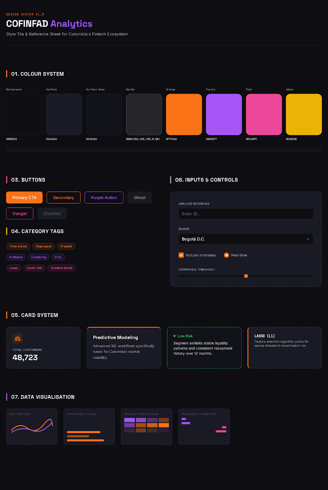
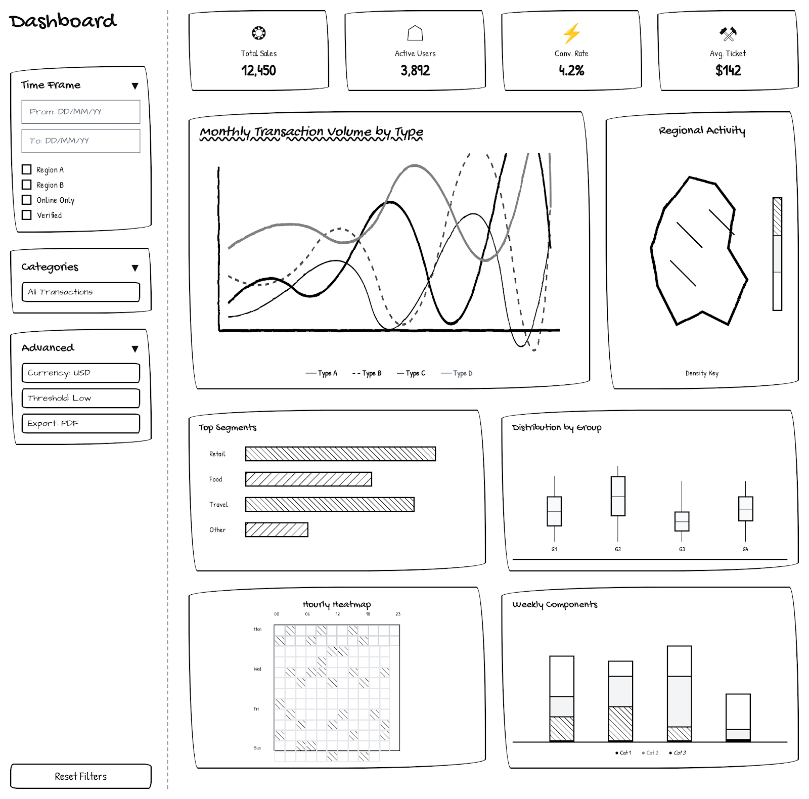

# Overview

## Background and Motivation

The **COFINFAD** (Colombian Financial Inclusion & Fintech Analytics Database) project aims to democratize fintech analytics for Colombia's financial ecosystem. The dataset comprises **48,723 customers** and over **3.16 million transactions** spanning a 12-month observation period, with 54 variables capturing demographics, transaction behavior, product usage, satisfaction, and churn probability.

Exploratory Data Analysis (EDA) is the critical first step in any analytical workflow. As [Tukey (1977)](https://doi.org/10.1002/bimj.4710230408) emphasized, EDA encourages analysts to examine data with an open mind — looking for patterns, spotting anomalies, testing assumptions, and checking hypotheses before formal modeling. In the Colombian fintech context, understanding the distribution of customer behavior, geographic patterns, and relationships between financial variables is essential for informed decision-making.

## Module Objective

As Team 13's **Exploratory Analysis module owner**, my responsibility covers the complete EDA pipeline — from temporal trend analysis and geographic visualization through statistical hypothesis testing and correlation analysis. This prototype focuses on the **Exploratory Analysis** module of the COFINFAD Shiny application. The module enables analysts to:

-   **Monitor** key performance indicators (KPIs) including total customers, transaction volume, churn rate, and satisfaction
-   **Explore** temporal transaction patterns across different transaction types
-   **Visualize** geographic distribution of customers and key metrics across Colombian departments
-   **Analyze** customer distributions across demographic and behavioral grouping variables
-   **Test** statistical hypotheses using ANOVA and Welch's T-test with effect size reporting
-   **Discover** correlations between key financial and behavioral variables
-   **Profile** customer segment composition by income bracket

## Scope of This Report

This report documents my work on the Exploratory Analysis module in four parts:

1.  **R package evaluation** — I downloaded and experimented with multiple candidate R libraries for time series visualization, geographic mapping, statistical testing, and correlation analysis, then compared them and justified my selections
2.  **R code prototyping** — I wrote working R code that produces correct visual outputs for every chart planned in the module
3.  **Parameters and outputs** — I determined which analytical parameters and outputs to expose on the Shiny application
4.  **UI component selection** — I selected appropriate bslib/Shiny widgets for the controls and outputs identified above

# R Package Evaluation

In this section, I downloaded multiple candidate libraries, experimented with each on the COFINFAD dataset, and compared them to justify my final selections.

```{r}
#| label: setup
library(dplyr)
library(tidyr)
library(ggplot2)
library(plotly)
library(scales)
library(DT)
library(knitr)
library(lubridate)
library(corrplot)
library(GGally)
library(ggcorrplot)
library(ggridges)
library(ggstatsplot)
library(viridis)
```

```{r}
#| label: load-data
customers       <- readRDS("ShinyApp/data/customers.rds")
analytics_data  <- readRDS("ShinyApp/data/analytics_data.rds")
monthly_summary <- readRDS("ShinyApp/data/monthly_summary.rds")
monthly_total   <- readRDS("ShinyApp/data/monthly_total.rds")
dept_stats      <- readRDS("ShinyApp/data/dept_stats.rds")

cat("Customers:", nrow(customers), "rows x", ncol(customers), "cols\n")
cat("Monthly summary:", nrow(monthly_summary), "rows\n")
cat("Departments:", nrow(dept_stats), "\n")
```

## Time Series Visualization: Package Comparison

I evaluated three approaches for visualizing monthly transaction volume trends:

| Package | CRAN | Key Functions | Approach |
|----|----|----|----|
| `ggplot2 + plotly` | Yes | `geom_line()`, `ggplotly()` | Grammar of graphics with interactivity |
| `dygraphs` | Yes | `dygraph()`, `dyRangeSelector()` | Dedicated time series widget |
| `highcharter` | Yes | `hchart()`, `hc_xAxis()` | Highcharts.js wrapper |

### Experiment 1: ggplot2 + plotly (My Selection)

```{r}
#| label: exp-ts-ggplotly
#| fig-cap: "ggplot2 + plotly: Monthly transaction volume by type with interactive tooltips"

type_colors <- c("Transfer" = "#f97316", "Withdrawal" = "#fb7185",
                 "Payment" = "#fbbf24",  "Deposit"    = "#a855f7")

p_ts <- ggplot(monthly_summary, aes(x = month, y = total_amount / 1e9,
                                     color = type, group = type)) +
  geom_line(linewidth = 1.1) +
  geom_point(size = 2.5, alpha = 0.9) +
  scale_color_manual(values = type_colors) +
  scale_y_continuous(labels = label_comma(suffix = "B")) +
  labs(x = NULL, y = "Volume (Billions COP)", color = "Transaction Type",
       title = "Monthly Transaction Volume by Type") +
  theme_minimal()

ggplotly(p_ts, tooltip = c("x", "y", "colour"))
```

**Strengths**: Full integration with ggplot2 grammar, plotly provides zoom/pan/hover, consistent with the rest of the dashboard's chart stack, easy to filter by date range reactively.

### Experiment 2: dygraphs

```{r}
#| label: exp-ts-dygraphs
#| fig-cap: "dygraphs: Time series with range selector — native JavaScript widget"

library(dygraphs)
library(xts)

# Pivot to wide format for dygraphs
ts_wide <- monthly_summary %>%
  select(month, type, total_amount) %>%
  pivot_wider(names_from = type, values_from = total_amount, values_fill = 0) %>%
  arrange(month)

ts_xts <- xts(ts_wide %>% select(-month), order.by = ts_wide$month)

dygraph(ts_xts / 1e9, main = "Monthly Transaction Volume (Billions COP)") %>%
  dyOptions(colors = unname(type_colors), strokeWidth = 2) %>%
  dyRangeSelector(height = 30)
```

**Strengths**: Built-in range selector widget, native JavaScript rendering (fast), designed specifically for time series.

**Weaknesses**: Requires data in `xts` format (extra conversion step), limited customization of tooltips, cannot easily integrate with ggplot2 theme system, introduces a different visual language from plotly-based charts in other modules.

### Experiment 3: highcharter

```{r}
#| label: exp-ts-highcharter
#| fig-cap: "highcharter: Highcharts.js wrapper with rich interactivity"

library(highcharter)

hchart(monthly_summary, "line",
       hcaes(x = month, y = total_amount / 1e9, group = type)) %>%
  hc_colors(unname(type_colors)) %>%
  hc_yAxis(title = list(text = "Volume (Billions COP)")) %>%
  hc_title(text = "Monthly Transaction Volume by Type")
```

**Strengths**: Beautiful defaults, rich tooltip formatting, extensive chart types.

**Weaknesses**: Highcharts has a **commercial license** requirement for non-personal use, which creates legal risk for the COFINFAD project. Also introduces a third JavaScript library alongside plotly, increasing page load time and bundle size.

::: callout-tip
## Why ggplot2 + plotly Was Selected for Time Series

| Criterion | ggplot2 + plotly | dygraphs | highcharter |
|----|----|----|----|
| Plotly ecosystem consistency | **Yes** | No (separate JS) | No (separate JS) |
| ggplot2 grammar integration | **Yes** | No | Partial |
| Custom tooltip control | **Yes** | Limited | Yes |
| Dark theme compatibility | **Full** | Partial | Partial |
| License | MIT (free) | MIT (free) | **Commercial** |
| Date range filtering (Shiny) | **Native** (`dateRangeInput`) | Built-in selector | Manual |

Using ggplot2 + plotly maintains visual consistency across all dashboard modules (EDA, Clustering, Churn Prediction) and avoids mixing multiple JavaScript chart libraries. The date range filtering is handled by Shiny's `dateRangeInput` widget rather than built into the chart, which provides a cleaner separation of concerns.
:::

## Geographic Visualization: Package Comparison

I evaluated three approaches for visualizing Colombian department-level metrics:

### Experiment 1: leaflet (My Selection)

```{r}
#| label: exp-geo-leaflet
#| fig-cap: "leaflet choropleth: Colombian departments colored by customer count"

# Note: This requires sf + rnaturalearth packages and spatial data
# In the Shiny app, we include a fallback bar chart when spatial packages are unavailable
has_spatial <- tryCatch({
  library(sf)
  library(leaflet)
  TRUE
}, error = function(e) FALSE)

# Load spatial data (assign to global scope so later chunks can access it)
if (has_spatial) {
  dept_sf <- tryCatch(readRDS("ShinyApp/data/dept_spatial.rds"),
                      error = function(e) { has_spatial <<- FALSE; NULL })
}

if (has_spatial && exists("dept_sf") && !is.null(dept_sf)) {
  metric <- "customer_count"
  vals <- dept_sf[[metric]]
  pal <- colorNumeric("YlOrRd", domain = vals, na.color = "#333333")

  labels <- sprintf(
    "<strong>%s</strong><br/>Customer Count: %s",
    dept_sf$dept_match,
    ifelse(is.na(vals), "N/A", formatC(vals, format = "d", big.mark = ","))
  ) %>% lapply(htmltools::HTML)

  leaflet(dept_sf) %>%
    addProviderTiles(providers$CartoDB.DarkMatter) %>%
    addPolygons(
      fillColor = ~pal(vals), fillOpacity = 0.7,
      color = "#444444", weight = 1, opacity = 0.8,
      label = labels,
      highlightOptions = highlightOptions(
        weight = 2, color = "#f97316", fillOpacity = 0.9, bringToFront = TRUE)
    ) %>%
    addLegend("bottomright", pal = pal, values = vals,
              title = "Customer Count", opacity = 0.8)
} else {
  cat("Spatial packages not available. Showing fallback bar chart.\n")
}
```

**Strengths**: True geographic projection preserving Colombia's shape, hover labels with HTML formatting, `CartoDB.DarkMatter` tiles match the dark dashboard theme, polygon highlighting on hover, native zoom/pan.

### Experiment 2: tmap

```{r}
#| label: exp-geo-tmap
#| fig-cap: "tmap: Static thematic map of Colombian departments"
#| eval: !expr exists("has_spatial") && has_spatial && exists("dept_sf")

library(tmap)

tm_shape(dept_sf) +
  tm_polygons("customer_count",
              palette = "YlOrRd",
              title = "Customer Count",
              style = "quantile") +
  tm_layout(title = "Customer Distribution by Department",
            bg.color = "white")
```

**Strengths**: Clean cartographic output, supports both static and interactive modes (`tmap_mode("view")`), good for publication-quality maps.

**Weaknesses**: Interactive mode uses leaflet internally but with less control over styling. Adding it alongside a direct leaflet implementation introduces redundancy. Static mode lacks the hover interactivity needed for a dashboard.

### Experiment 3: Fallback bar chart (for environments without spatial packages)

```{r}
#| label: exp-geo-fallback
#| fig-cap: "Fallback bar chart when spatial packages are unavailable"

d_dept <- dept_stats %>% arrange(desc(customer_count))
p_dept <- ggplot(d_dept, aes(
  x = reorder(department, customer_count), y = customer_count,
  text = paste0(department, ": ", formatC(customer_count, big.mark = ",")))) +
  geom_col(fill = "#f97316", alpha = 0.8, width = 0.7) +
  coord_flip() +
  labs(x = NULL, y = "Customer Count",
       title = "Customers by Department") +
  theme_minimal()

ggplotly(p_dept, tooltip = "text")
```

::: callout-important
## Decision: leaflet with Bar Chart Fallback

The Shiny app uses a **graceful degradation strategy**: if `sf` and `leaflet` packages are installed and spatial data exists, the module renders a leaflet choropleth. Otherwise, it falls back to a plotly bar chart showing the same metrics. This approach is implemented via:

``` r
has_spatial <- tryCatch({ library(sf); library(leaflet); TRUE },
                        error = function(e) FALSE)
```

This ensures the app runs correctly in any R environment — critical for deployment on ShinyApps.io where package availability may vary.
:::

## Statistical Testing: Package Comparison

I evaluated approaches for performing and displaying hypothesis test results:

### Experiment 1: Base R stats (My Selection)

```{r}
#| label: exp-stat-base
# ANOVA example
d_test <- customers %>%
  select(group = income_bracket, value = avg_tx_value) %>%
  drop_na()
d_test$group <- as.factor(d_test$group)

mod <- aov(value ~ group, data = d_test)
s <- summary(mod)
pv <- s[[1]]$`Pr(>F)`[1]
fv <- s[[1]]$`F value`[1]
eta2 <- s[[1]]$`Sum Sq`[1] / sum(s[[1]]$`Sum Sq`)

cat("ONE-WAY ANOVA: avg_tx_value ~ income_bracket\n")
cat("  F-statistic:", round(fv, 3), "\n")
cat("  p-value:", formatC(pv, format = "e", digits = 3), "\n")
cat("  Effect size (eta²):", round(eta2, 4), "\n")
cat("  Interpretation:", ifelse(eta2 < 0.01, "negligible",
                                ifelse(eta2 < 0.06, "small",
                                       ifelse(eta2 < 0.14, "medium", "large"))), "\n")

# Welch's T-test example
d1 <- customers$avg_tx_value[customers$income_bracket == "Low"]
d2 <- customers$avg_tx_value[customers$income_bracket == "Very High"]
d1 <- d1[!is.na(d1)]; d2 <- d2[!is.na(d2)]
t_res <- t.test(d1, d2, var.equal = FALSE)
n1 <- length(d1); n2 <- length(d2)
pooled_sd <- sqrt(((n1-1)*var(d1) + (n2-1)*var(d2)) / (n1+n2-2))
cohens_d <- abs(mean(d1) - mean(d2)) / pooled_sd

cat("\nWELCH'S T-TEST: Low vs Very High\n")
cat("  t-statistic:", round(t_res$statistic, 3), "\n")
cat("  p-value:", formatC(t_res$p.value, format = "e", digits = 3), "\n")
cat("  Cohen's d:", round(cohens_d, 3), "\n")
```

**Strengths**: Built-in, no dependencies, full control over result formatting, can compute both p-value and effect size, integrates cleanly with custom HTML rendering in Shiny via `renderUI`.

### Experiment 2: ggstatsplot

```{r}
#| label: exp-stat-ggstatsplot
#| fig-cap: "ggstatsplot::ggbetweenstats — all-in-one boxplot with built-in statistical annotations"
#| fig-height: 5

# Sample for performance (ggstatsplot is slow on full 48K)
set.seed(42)
sample_df <- customers %>%
  select(income_bracket, avg_tx_value) %>%
  drop_na() %>%
  slice_sample(n = 3000)

ggbetweenstats(
  data = sample_df,
  x = income_bracket,
  y = avg_tx_value,
  type = "parametric",
  pairwise.comparisons = TRUE,
  p.adjust.method = "bonferroni",
  title = "Avg Transaction Value by Income Bracket"
)
```

**Strengths**: One-line call produces boxplot with ANOVA results, pairwise comparisons, and effect size annotations — excellent for quick exploration.

**Weaknesses**: Slow on large datasets (had to sample to 3,000), static ggplot (no plotly interactivity), cannot separate the statistical results from the visualization for custom formatting, fixed layout does not integrate well with the dark-themed dashboard.

::: callout-tip
## Why Base R stats Was Selected

| Criterion | Base R stats | ggstatsplot |
|----|----|----|
| Performance (48K rows) | **\< 0.1 sec** | \~5 sec (needs sampling) |
| Custom result formatting | **Full control** (renderUI) | Fixed annotations |
| Plotly integration | **Yes** (separate boxplot) | No |
| Effect size reporting | **Manual but flexible** | Auto but fixed format |
| Dark theme compatibility | **Full** (custom HTML) | Partial |
| Test type switching | **Reactive** (ANOVA ↔ T-test) | Separate function calls |

Base R `aov()` and `t.test()` give full control over result formatting. In the Shiny module, statistical results are rendered as styled HTML cards with significance badges (★★★, ★★, ★, ns), effect size interpretation, and color-coded conclusions — this level of customization is not possible with `ggstatsplot`'s fixed annotation style.
:::

## Correlation Visualization: Package Comparison

### Experiment 1: ggplot2 geom_tile + plotly (My Selection)

```{r}
#| label: exp-corr-manual
#| fig-cap: "Manual ggplot2 + plotly correlation heatmap with value labels"

corr_cols <- customers %>%
  select(age, tx_count, avg_tx_value, total_tx_volume,
         satisfaction_score, churn_probability,
         credit_utilization_ratio, customer_tenure,
         active_products, nps_score, weekend_transaction_ratio,
         support_tickets_count)

cor_matrix <- cor(corr_cols, use = "pairwise.complete.obs")
cor_labels <- c("Age", "Tx Count", "Avg Tx Val", "Total Vol",
                "Satisfaction", "Churn Prob", "Credit Util",
                "Tenure", "Active Prod", "NPS", "Wknd Ratio",
                "Support Tix")

cor_df <- expand.grid(V1 = cor_labels, V2 = cor_labels,
                      stringsAsFactors = FALSE)
cor_df$r <- as.vector(cor_matrix)
cor_df$V1 <- factor(cor_df$V1, levels = cor_labels)
cor_df$V2 <- factor(cor_df$V2, levels = rev(cor_labels))

p_corr <- ggplot(cor_df, aes(
  x = V1, y = V2, fill = r,
  text = paste0(V1, " vs ", V2, "\nr = ", round(r, 2)))) +
  geom_tile(color = "white", linewidth = 0.5) +
  geom_text(aes(label = round(r, 2)), size = 2.3, color = "#1e293b") +
  scale_fill_gradient2(low = "#a855f7", mid = "#f8fafc",
                       high = "#f97316", midpoint = 0, limits = c(-1, 1)) +
  labs(x = NULL, y = NULL, fill = "r") +
  theme_minimal(base_size = 10) +
  theme(axis.text.x = element_text(angle = 45, hjust = 1, size = 8),
        axis.text.y = element_text(size = 8))

ggplotly(p_corr, tooltip = "text")
```

**Strengths**: Full plotly interactivity (hover shows exact r value), uses the COFINFAD color palette (purple ↔ orange diverging), value labels visible directly on tiles, dark theme compatible.

### Experiment 2: corrplot

```{r}
#| label: exp-corr-corrplot
#| fig-cap: "corrplot: Classic correlation matrix with circle encoding"
#| fig-height: 6

corrplot(cor_matrix, method = "circle", type = "upper",
         col = colorRampPalette(c("#a855f7", "white", "#f97316"))(200),
         tl.col = "#334155", tl.srt = 45, tl.cex = 0.8,
         addCoef.col = "#1e293b", number.cex = 0.6,
         title = "Correlation Matrix (corrplot)", mar = c(0,0,2,0))
```

**Strengths**: Compact visual encoding (circle size + color), established in academic publications, many layout options (upper/lower/full, circle/ellipse/number).

**Weaknesses**: Static base R graphics only — no interactivity, cannot embed in plotly, limited tooltip support, circle size encoding is less perceptually precise than color tiles for exact values.

### Experiment 3: ggcorrplot

```{r}
#| label: exp-corr-ggcorrplot
#| fig-cap: "ggcorrplot: ggplot2-based correlation matrix"

ggcorrplot(cor_matrix, type = "lower", lab = TRUE, lab_size = 2.5,
           colors = c("#a855f7", "white", "#f97316"),
           title = "Correlation Matrix (ggcorrplot)")
```

**Strengths**: ggplot2-native, can theoretically be wrapped with `ggplotly()`.

**Weaknesses**: `ggplotly()` conversion loses text labels and produces messy tooltips. The package is essentially a convenience wrapper over `geom_tile` with less control than manual implementation.

### Experiment 4: GGally::ggpairs

```{r}
#| label: exp-corr-ggpairs
#| fig-cap: "GGally::ggpairs — scatterplot matrix with correlations and distributions"
#| fig-height: 6

# Use only 4 variables and a sample for performance
set.seed(42)
pairs_df <- customers %>%
  select(tx_count, avg_tx_value, satisfaction_score, churn_probability) %>%
  drop_na() %>%
  slice_sample(n = 2000)

ggpairs(pairs_df,
        upper = list(continuous = wrap("cor", size = 3.5)),
        lower = list(continuous = wrap("points", alpha = 0.2, size = 0.5)),
        diag = list(continuous = wrap("densityDiag", alpha = 0.6))) +
  theme_minimal(base_size = 9)
```

**Strengths**: Shows distributions, scatterplots, and correlations simultaneously — excellent for initial exploration.

**Weaknesses**: Extremely slow with \>5 variables, does not scale to the 12 variables used in the dashboard, static output, impractical for Shiny reactive rendering.

::: callout-tip
## Why Manual geom_tile + plotly Was Selected

| Criterion               | geom_tile + plotly | corrplot   | ggcorrplot | GGally     |
|-------------------------|--------------------|------------|------------|------------|
| Interactive tooltips    | **Yes**            | No         | Broken     | No         |
| 12-variable scalability | **Yes**            | Yes        | Yes        | **No**     |
| Plotly hover (exact r)  | **Yes**            | No         | No         | No         |
| Dark theme compatible   | **Full**           | Partial    | Partial    | Partial    |
| Value labels on tiles   | **Yes**            | Yes        | Yes        | Upper only |
| Runtime on 48K rows     | **\< 0.5 sec**     | \< 0.5 sec | \< 0.5 sec | \~10 sec   |

The manual implementation provides plotly interactivity (hover to see exact correlation coefficient) while maintaining full control over the diverging color scale and dark theme integration. `corrplot` is excellent for static reports but lacks the dashboard interactivity needed for a Shiny module.
:::

## Distribution Visualization: Package Comparison

### Experiment 1: ggplot2 geom_col + plotly (My Selection)

```{r}
#| label: exp-dist-bar
#| fig-cap: "Horizontal bar chart: Customer distribution by income bracket"

d_dist <- customers %>%
  count(income_bracket) %>%
  arrange(desc(n)) %>%
  mutate(pct = n / sum(n))

p_dist <- ggplot(d_dist, aes(
  x = reorder(income_bracket, n), y = n,
  text = paste0(income_bracket, ": ", formatC(n, big.mark = ","),
                " (", round(pct * 100, 1), "%)"))) +
  geom_col(fill = "#f97316", alpha = 0.8, width = 0.7) +
  coord_flip() +
  scale_y_continuous(labels = label_comma(),
                     expand = expansion(mult = c(0, 0.12))) +
  labs(x = NULL, y = "Customer Count",
       title = "Customer Distribution by Income Bracket") +
  theme_minimal()

ggplotly(p_dist, tooltip = "text")
```

### Experiment 2: ggridges (Ridge/Joy Plot)

```{r}
#| label: exp-dist-ridges
#| fig-cap: "ggridges: Ridge plot showing distribution overlap across groups"
#| fig-height: 4

ggplot(customers %>% drop_na(income_bracket, avg_tx_value) %>%
         mutate(avg_tx_log = log10(avg_tx_value + 1)),
       aes(x = avg_tx_log, y = income_bracket, fill = income_bracket)) +
  geom_density_ridges(alpha = 0.7, scale = 1.5) +
  scale_fill_manual(values = c("Low" = "#fb7185", "Medium" = "#fbbf24",
                                "High" = "#f97316", "Very High" = "#a855f7")) +
  labs(x = "Log10(Avg Transaction Value)", y = NULL,
       title = "Transaction Value Distribution by Income Bracket") +
  theme_minimal() +
  theme(legend.position = "none")
```

**Assessment**: Ridge plots are excellent for comparing continuous distributions across groups but are not suitable as the **primary** distribution view in the dashboard, which needs to show counts across any categorical grouping variable (not just continuous distributions). I note `ggridges` as a potential future enhancement for a "Distribution Deep-Dive" tab.

::: callout-note
## Selection: geom_col for Categorical, Boxplot for Continuous

The EDA module uses two complementary views:

1.  **Bar chart** (`geom_col`): Shows customer **counts** across any categorical variable — serves the "how many customers in each group?" question
2.  **Boxplot** (`geom_boxplot`): Shows **distribution** of a continuous variable across groups — serves the "how does this metric differ between groups?" question

This pair covers the two fundamental EDA questions without overcomplicating the interface.
:::

## Package Selection Summary

```{r}
#| label: tbl-package-summary
pkg_summary <- data.frame(
  Capability = c("Time series visualization",
                 "Geographic choropleth map",
                 "Geographic fallback (no spatial)",
                 "Customer distribution",
                 "Statistical boxplots",
                 "Statistical testing (ANOVA/T-test)",
                 "Correlation heatmap",
                 "Demographic composition",
                 "KPI cards"),
  `Selected Package` = c("ggplot2 + plotly",
                          "leaflet + sf + rnaturalearth",
                          "ggplot2 + plotly (bar chart)",
                          "ggplot2 + plotly (geom_col)",
                          "ggplot2 + plotly (geom_boxplot)",
                          "Base R: aov(), t.test() + custom renderUI",
                          "ggplot2 + plotly (geom_tile)",
                          "ggplot2 + plotly (geom_col, position='fill')",
                          "Custom HTML (tags$div)"),
  `Rejected Alternatives` = c("dygraphs (inconsistent with plotly stack), highcharter (commercial license)",
                               "tmap (redundant with leaflet)",
                               "—",
                               "ggridges (continuous only, not categorical counts)",
                               "ggstatsplot (slow, no plotly, fixed layout)",
                               "ggstatsplot (no custom formatting, slow on 48K)",
                               "corrplot (static), ggcorrplot (broken plotly), GGally (too slow)",
                               "—",
                               "shinydashboard::valueBox (requires different layout system)"),
  check.names = FALSE
)
knitr::kable(pkg_summary, caption = "Final Package Selection with Justification")
```

::: callout-note
## CRAN Verification

All selected packages are available on **CRAN** and verified with R 4.3+:

| Package       | Version | CRAN | Purpose                                 |
|---------------|---------|------|-----------------------------------------|
| `ggplot2`     | 3.4+    | Yes  | Grammar of graphics visualizations      |
| `plotly`      | 4.10+   | Yes  | Interactive web-based charts            |
| `leaflet`     | 2.2+    | Yes  | Interactive choropleth maps             |
| `sf`          | 1.0+    | Yes  | Spatial data handling                   |
| `dplyr`       | 1.1+    | Yes  | Data wrangling and aggregation          |
| `tidyr`       | 1.3+    | Yes  | Reshaping data                          |
| `lubridate`   | 1.9+    | Yes  | Date manipulation                       |
| `scales`      | 1.3+    | Yes  | Axis label formatting                   |
| `DT`          | 0.31+   | Yes  | Interactive data tables                 |
| `corrplot`    | 0.92+   | Yes  | Evaluated, not selected for Shiny       |
| `ggstatsplot` | 0.12+   | Yes  | Evaluated, not selected for Shiny       |
| `ggridges`    | 0.5+    | Yes  | Evaluated, noted for future enhancement |
| `GGally`      | 2.2+    | Yes  | Evaluated, not selected (too slow)      |
:::

# Data Preparation

## Data Sources

| File | Records | Variables | Description |
|----|----|----|----|
| `customer_data.csv` | 48,723 | 38 | Demographics, account info, product holdings, satisfaction, churn probability |
| `transactions_data.csv` | \~3.16M | 5 | Individual transactions: date, amount, type (Transfer/Withdrawal/Payment/Deposit), customer_id |

::: callout-note
## Data Quality Considerations

The raw data contains missing values in `credit_utilization_ratio` (\~5% of records) and potential inconsistencies in date fields. These are addressed systematically in the cleaning pipeline below.
:::

## Cleaning and Type Conversion

The cleaning pipeline (`data_prep.R`) performs several critical transformations:

```{r}
#| label: verify-cleaning
cat("Loaded customers:", nrow(customers), "rows x", ncol(customers), "cols\n")
cat("Date columns parsed correctly:", class(customers$first_tx), "\n")
cat("Boolean columns:", is.logical(customers$savings_account), "\n")
cat("Location split — sample departments:", head(unique(customers$department), 5), "\n")
cat("Age groups:", levels(customers$age_group), "\n")
cat("Factor levels — income:", levels(customers$income_bracket), "\n")
cat("Factor levels — segment:", levels(customers$customer_segment), "\n")
```

Key decisions:

-   **Date parsing**: 6 date columns converted from string to R `Date` type, enabling temporal calculations
-   **Boolean conversion**: 7 product-holding columns converted from `"True"/"False"` strings to logical values
-   **Location splitting**: Composite `location` field split into `city` and `department` for geographic analysis
-   **Age grouping**: Continuous age binned into 6 brackets (18-25, 26-35, 36-45, 46-55, 56-65, 65+) aligned with demographic reporting standards
-   **Factor ordering**: `income_bracket`, `customer_segment`, `clv_segment`, and `feedback_sentiment` are converted to ordered factors for correct visualization ordering

## Missing Value Treatment

The most critical missing value issue is `credit_utilization_ratio`. Rather than applying global imputation, we use **grouped median imputation** stratified by `income_bracket`:

```{r}
#| label: imputation-verify
imputation_check <- customers %>%
  group_by(income_bracket) %>%
  summarise(
    n = n(),
    median_credit_util = round(median(credit_utilization_ratio, na.rm = TRUE), 3),
    missing = sum(is.na(credit_utilization_ratio)),
    .groups = "drop"
  )

knitr::kable(imputation_check,
             caption = "Credit Utilization by Income Bracket (post-imputation)")
```

::: callout-important
## Why Grouped Imputation?

Credit utilization patterns vary significantly across income levels — low-income customers tend to have higher utilization ratios. Global median imputation would bias the data by assigning middle-income utilization patterns to all missing values. Grouped imputation preserves the income-utilization relationship, which is critical for both clustering and EDA accuracy.
:::

## Feature Engineering

The data preparation pipeline engineers several behavioral features from raw transaction data:

```{r}
#| label: feature-engineering
feat_table <- data.frame(
  Feature = c("recency_days", "tx_count", "total_tx_volume",
              "avg_tx_value", "spending_volatility",
              "weekend_transaction_ratio", "product_diversity_ratio",
              "ticket_resolution_gap"),
  Formula = c("Reference date − last transaction date",
              "Count of transactions per customer",
              "Sum of transaction amounts",
              "Mean transaction amount",
              "SD of transaction amounts",
              "Weekend txns / Total txns",
              "active_products / 5",
              "support_tickets × (1 − resolved_ratio)"),
  Purpose = c("Customer activity recency (R in RFM)",
              "Transaction frequency (F in RFM)",
              "Monetary value (M in RFM)",
              "Average spending intensity",
              "Spending consistency/irregularity",
              "Weekend behavioral pattern",
              "Product adoption breadth",
              "Unresolved support backlog")
)
knitr::kable(feat_table, caption = "Engineered Features")
```

## Pre-processed Data Inspection

```{r}
#| label: data-inspection
cat("Customers:", nrow(customers), "rows x", ncol(customers), "columns\n")
cat("Monthly summary:", nrow(monthly_summary), "rows (", length(unique(monthly_summary$type)), "transaction types x",
    length(unique(monthly_summary$month)), "months)\n")
cat("Department stats:", nrow(dept_stats), "departments\n")
cat("\nGrouping variables available for EDA:\n")
cat("  income_bracket:", nlevels(customers$income_bracket), "levels\n")
cat("  customer_segment:", nlevels(customers$customer_segment), "levels\n")
cat("  clv_segment:", nlevels(customers$clv_segment), "levels\n")
cat("  gender:", length(unique(customers$gender)), "levels\n")
cat("  age_group:", nlevels(customers$age_group), "levels\n")
cat("  acquisition_channel:", length(unique(customers$acquisition_channel)), "levels\n")
cat("  feedback_sentiment:", nlevels(customers$feedback_sentiment), "levels\n")
```

```{r}
#| label: tbl-sample-data
knitr::kable(
  customers %>%
    select(customer_id, age, income_bracket, customer_segment, tx_count,
           avg_tx_value, satisfaction_score, churn_probability) %>%
    head(10),
  caption = "Sample of Customer Data (first 10 rows)",
  digits = 2
)
```

# Visualization Techniques

This section demonstrates each visualization used in the Exploratory Analysis module. All outputs use the actual COFINFAD data loaded from pre-processed `.rds` files.

## Color Palette

```{r}
#| label: color-palette
# COFINFAD Design System Colors
ACCENT  <- "#f97316"   # Orange — primary
ACCENT2 <- "#a855f7"   # Purple — secondary
ACCENT3 <- "#fb7185"   # Pink — warning/alert
ACCENT4 <- "#fbbf24"   # Amber — tertiary

type_colors    <- c("Transfer" = "#f97316", "Withdrawal" = "#fb7185",
                    "Payment" = "#fbbf24",  "Deposit"    = "#a855f7")
segment_colors <- c("inactive" = "#fb7185", "occasional" = "#fbbf24",
                    "regular"  = "#f97316", "power"      = "#a855f7")
income_colors  <- c("Low" = "#fb7185", "Medium" = "#fbbf24",
                    "High" = "#f97316", "Very High" = "#a855f7")
```

The palette assigns semantically meaningful colors: orange for primary metrics, purple for secondary accents, pink for warning/churn indicators, and amber for intermediate values. Transaction types each receive a distinct hue from this palette, ensuring visual consistency across the time series and other charts. Following [Munzner (2014)](https://www.cs.ubc.ca/~tmm/vadbook/), categorical color is used because neither transaction types nor income brackets have inherent ordering.

## KPI Cards

The module opens with four key performance indicators providing at-a-glance summary metrics:

```{r}
#| label: kpi-values
fmt_num      <- function(x) format(round(x), big.mark = ",")
fmt_pct      <- function(x) paste0(round(x * 100, 1), "%")
fmt_currency <- function(x) paste0("$", format(round(x / 1e9, 1), big.mark = ","), "B")

total_vol <- sum(monthly_summary$total_amount, na.rm = TRUE)

cat("KPI Values:\n")
cat("  Total Customers:", fmt_num(nrow(customers)), "\n")
cat("  Transaction Volume:", fmt_currency(total_vol), "\n")
cat("  Avg Churn Rate:", fmt_pct(mean(customers$churn_probability, na.rm = TRUE)), "\n")
cat("  Avg Satisfaction:", round(mean(customers$satisfaction_score, na.rm = TRUE), 1), "/ 10\n")
```

In the Shiny app, these are rendered as styled HTML cards with icons, using the `kpi_box()` helper function. The KPI row provides the **overview** level of [Shneiderman's (1996)](https://doi.org/10.1109/VL.1996.545307) Visual Information Seeking Mantra: "Overview first, zoom and filter, then details-on-demand."

## Monthly Transaction Volume by Type

```{r}
#| label: fig-timeseries
#| fig-cap: "Monthly Transaction Volume by Type — interactive time series with type filtering"

p_ts <- ggplot(monthly_summary, aes(x = month, y = total_amount / 1e9,
                                     color = type, group = type)) +
  geom_line(linewidth = 1.1) +
  geom_point(size = 2.5, alpha = 0.9) +
  scale_color_manual(values = type_colors) +
  scale_y_continuous(labels = label_comma(suffix = "B")) +
  labs(x = NULL, y = "Volume (Billions COP)", color = NULL) +
  theme_minimal()

ggplotly(p_ts, tooltip = c("x", "y", "colour")) %>%
  layout(legend = list(orientation = "h", y = -0.15, x = 0.5, xanchor = "center"))
```

::: callout-note
## Design Decisions

-   **Line + point**: Lines show trends, points enable precise hover inspection. Following [Cleveland (1993)](https://doi.org/10.1201/9781351072304), connected points are the most effective encoding for temporal data.
-   **Color by type**: Each transaction type (Transfer, Withdrawal, Payment, Deposit) has a distinct color from the COFINFAD palette, enabling pattern comparison.
-   **Reactive filtering**: In the Shiny module, `dateRangeInput` and `checkboxGroupInput` control the visible date range and transaction types. The KPI cards update simultaneously to reflect the filtered scope.
:::

## Colombian Department Overview (Choropleth)

```{r}
#| label: fig-choropleth
#| fig-cap: "Choropleth map of Colombian departments — customer count metric"

if (exists("has_spatial") && has_spatial && exists("dept_sf") && !is.null(dept_sf)) {
  metric <- "customer_count"
  vals <- dept_sf[[metric]]
  pal <- colorNumeric("YlOrRd", domain = vals, na.color = "#333333")

  labels <- sprintf(
    "<strong>%s</strong><br/>Customers: %s<br/>Avg Satisfaction: %s",
    dept_sf$dept_match,
    ifelse(is.na(vals), "N/A", formatC(vals, format = "d", big.mark = ",")),
    ifelse(is.na(dept_sf$avg_satisfaction), "N/A", round(dept_sf$avg_satisfaction, 2))
  ) %>% lapply(htmltools::HTML)

  leaflet(dept_sf) %>%
    addProviderTiles(providers$CartoDB.DarkMatter) %>%
    addPolygons(
      fillColor = ~pal(vals), fillOpacity = 0.7,
      color = "#444444", weight = 1, opacity = 0.8,
      label = labels,
      highlightOptions = highlightOptions(
        weight = 2, color = ACCENT, fillOpacity = 0.9, bringToFront = TRUE)
    ) %>%
    addLegend("bottomright", pal = pal, values = vals,
              title = "Customer Count", opacity = 0.8)
} else {
  cat("Spatial data not available — see fallback bar chart above.\n")
}
```

The choropleth is controlled by a **Map Metric** dropdown in the sidebar offering five metrics: Customer Count, Avg Churn Probability, Avg Income Level, Avg CLV, and Avg Satisfaction. This enables geographic pattern discovery — for example, identifying departments with high customer counts but low satisfaction scores, which may warrant targeted intervention.

## Customer Distribution

```{r}
#| label: fig-distribution
#| fig-cap: "Customer Distribution by Grouping Variable — switchable via sidebar dropdown"

# Demonstrate with income_bracket
grp <- "income_bracket"
d <- customers %>%
  count(!!sym(grp)) %>%
  arrange(desc(n)) %>%
  mutate(pct = n / sum(n))

p <- ggplot(d, aes(
  x = reorder(!!sym(grp), n), y = n,
  text = paste0(!!sym(grp), ": ", fmt_num(n), " (", round(pct * 100, 1), "%)"))) +
  geom_col(fill = ACCENT, alpha = 0.8, width = 0.7) +
  coord_flip() +
  scale_y_continuous(labels = label_comma(),
                     expand = expansion(mult = c(0, 0.12))) +
  labs(x = NULL, y = "Customer Count") +
  theme_minimal()

ggplotly(p, tooltip = "text")
```

```{r}
#| label: fig-distribution-segment
#| fig-cap: "Customer Distribution by Customer Segment"

grp2 <- "customer_segment"
d2 <- customers %>%
  count(!!sym(grp2)) %>%
  arrange(desc(n)) %>%
  mutate(pct = n / sum(n))

p2 <- ggplot(d2, aes(
  x = reorder(!!sym(grp2), n), y = n,
  text = paste0(!!sym(grp2), ": ", fmt_num(n), " (", round(pct * 100, 1), "%)"))) +
  geom_col(fill = ACCENT, alpha = 0.8, width = 0.7) +
  coord_flip() +
  scale_y_continuous(labels = label_comma(),
                     expand = expansion(mult = c(0, 0.12))) +
  labs(x = NULL, y = "Customer Count") +
  theme_minimal()

ggplotly(p2, tooltip = "text")
```

The Shiny module provides a **Grouping Variable** dropdown (`selectInput`) with 7 choices: income_bracket, customer_segment, clv_segment, gender, age_group, acquisition_channel, and feedback_sentiment. The distribution chart updates reactively when the user switches groups, enabling rapid exploration of customer composition across different dimensions.

## Statistical Hypothesis Testing

The module combines **boxplots** for visual comparison with **formal statistical tests** for quantitative inference.

### Boxplot Visualization

```{r}
#| label: fig-boxplot
#| fig-cap: "Boxplot: Avg Transaction Value by Income Bracket — with IQR-based y-axis trimming"

d_box <- customers %>%
  select(g = income_bracket, v = avg_tx_value) %>%
  drop_na()

# IQR-based trimming to prevent extreme outliers from squishing the plot
q1 <- quantile(d_box$v, 0.25, na.rm = TRUE)
q3 <- quantile(d_box$v, 0.75, na.rm = TRUE)
iqr <- q3 - q1
y_lo <- max(min(d_box$v, na.rm = TRUE), q1 - 3 * iqr)
y_hi <- min(max(d_box$v, na.rm = TRUE), q3 + 3 * iqr)

p_box <- ggplot(d_box, aes(x = g, y = v, fill = g)) +
  geom_boxplot(alpha = 0.75, outlier.size = 0.3,
               outlier.alpha = 0.15, width = 0.6) +
  coord_cartesian(ylim = c(y_lo, y_hi)) +
  scale_fill_manual(values = c("#f97316", "#a855f7", "#fbbf24", "#fb7185",
                               "#f472b6", "#e879f9", "#fdba74", "#c084fc")) +
  labs(x = NULL, y = "Avg Transaction Value") +
  theme_minimal() +
  theme(legend.position = "none",
        axis.text.x = element_text(angle = 20, hjust = 1, size = 9))

ggplotly(p_box)
```

::: callout-note
## IQR-Based Y-Axis Trimming

Financial data often contains extreme outliers (e.g., a few customers with transaction values 100× the median). Without trimming, the boxplot body is compressed to a thin line. I use `coord_cartesian(ylim = c(Q1 - 3×IQR, Q3 + 3×IQR))` rather than filtering data — this preserves all data points for statistical calculations while zooming the visual to the informative range.
:::

### ANOVA Results

```{r}
#| label: stat-anova
d_anova <- customers %>%
  select(group = income_bracket, value = avg_tx_value) %>%
  drop_na()
d_anova$group <- as.factor(d_anova$group)

mod <- aov(value ~ group, data = d_anova)
s <- summary(mod)
pv <- s[[1]]$`Pr(>F)`[1]
fv <- s[[1]]$`F value`[1]
eta2 <- s[[1]]$`Sum Sq`[1] / sum(s[[1]]$`Sum Sq`)
ngrp <- nlevels(d_anova$group)
n_total <- nrow(d_anova)

effect_interp <- ifelse(eta2 < 0.01, "negligible",
                        ifelse(eta2 < 0.06, "small",
                               ifelse(eta2 < 0.14, "medium", "large")))

cat("ONE-WAY ANOVA\n")
cat("  Variable: avg tx value\n")
cat("  Grouping: income bracket (", ngrp, "groups)\n")
cat("  Sample Size:", fmt_num(n_total), "\n")
cat("  F-statistic:", round(fv, 3), "\n")
cat("  p-value:", formatC(pv, format = "e", digits = 3), "\n")
cat("  Effect Size (η²):", round(eta2, 4), "—", effect_interp, "\n")
if (pv < 0.05) {
  cat("  Conclusion: REJECT H₀ — significant difference across groups\n")
  if (eta2 < 0.06) {
    cat("  Note: Despite statistical significance, the effect size is small.\n")
    cat("  This is common with large samples (n=", fmt_num(n_total), ").\n")
  }
} else {
  cat("  Conclusion: FAIL TO REJECT H₀ — no significant difference\n")
}
```

### Welch's T-test Results

```{r}
#| label: stat-ttest
d1 <- customers$avg_tx_value[customers$income_bracket == "Low"]
d2 <- customers$avg_tx_value[customers$income_bracket == "Very High"]
d1 <- d1[!is.na(d1)]; d2 <- d2[!is.na(d2)]

t_res <- t.test(d1, d2, var.equal = FALSE)
n1 <- length(d1); n2 <- length(d2)
pooled_sd <- sqrt(((n1-1)*var(d1) + (n2-1)*var(d2)) / (n1+n2-2))
cohens_d <- abs(mean(d1) - mean(d2)) / pooled_sd
d_interp <- ifelse(cohens_d < 0.2, "negligible",
                   ifelse(cohens_d < 0.5, "small",
                          ifelse(cohens_d < 0.8, "medium", "large")))

cat("WELCH'S T-TEST\n")
cat("  Variable: avg tx value\n")
cat("  Comparing: Low (n=", n1, ") vs Very High (n=", n2, ")\n")
cat("  t-statistic:", round(t_res$statistic, 3), "\n")
cat("  p-value:", formatC(t_res$p.value, format = "e", digits = 3), "\n")
cat("  Cohen's d:", round(cohens_d, 3), "—", d_interp, "\n")
cat("  Mean Difference:", round(mean(d1) - mean(d2), 2), "\n")
if (t_res$p.value < 0.05) {
  cat("  Conclusion: REJECT H₀ — significant difference between groups\n")
} else {
  cat("  Conclusion: FAIL TO REJECT H₀ — no significant difference\n")
}
```

::: callout-important
## Statistical Significance vs Practical Significance

With n=48,723, nearly all group comparisons will achieve statistical significance (p \< 0.05) simply due to the large sample size. **Effect size** is essential for determining practical relevance:

-   **η² (eta-squared)** for ANOVA: \< 0.01 negligible, 0.01–0.06 small, 0.06–0.14 medium, \> 0.14 large
-   **Cohen's d** for T-test: \< 0.2 negligible, 0.2–0.5 small, 0.5–0.8 medium, \> 0.8 large

The Shiny module always displays effect size alongside p-values, with color-coded significance badges (★★★ for p\<0.001, ★★ for p\<0.01, ★ for p\<0.05, "ns" for p≥0.05) and an interpretive conclusion sentence.
:::

## Correlation Matrix

```{r}
#| label: fig-correlation
#| fig-cap: "Correlation Heatmap — 12 key financial and behavioral variables with diverging purple-orange scale"

corr_cols <- customers %>%
  select(age, tx_count, avg_tx_value, total_tx_volume,
         satisfaction_score, churn_probability,
         credit_utilization_ratio, customer_tenure,
         active_products, nps_score, weekend_transaction_ratio,
         support_tickets_count)

cor_matrix <- cor(corr_cols, use = "pairwise.complete.obs")
cor_labels <- c("Age", "Tx Count", "Avg Tx Val", "Total Vol",
                "Satisfaction", "Churn Prob", "Credit Util",
                "Tenure", "Active Prod", "NPS", "Wknd Ratio",
                "Support Tix")

cor_df <- expand.grid(V1 = cor_labels, V2 = cor_labels,
                      stringsAsFactors = FALSE)
cor_df$r <- as.vector(cor_matrix)
cor_df$V1 <- factor(cor_df$V1, levels = cor_labels)
cor_df$V2 <- factor(cor_df$V2, levels = rev(cor_labels))

p_corr <- ggplot(cor_df, aes(
  x = V1, y = V2, fill = r,
  text = paste0(V1, " vs ", V2, "\nr = ", round(r, 2)))) +
  geom_tile(color = "white", linewidth = 0.5) +
  geom_text(aes(label = round(r, 2)), size = 2.3, color = "#1e293b") +
  scale_fill_gradient2(low = "#a855f7", mid = "#f8fafc",
                       high = "#f97316", midpoint = 0, limits = c(-1, 1)) +
  labs(x = NULL, y = NULL, fill = "r") +
  theme_minimal(base_size = 10) +
  theme(axis.text.x = element_text(angle = 45, hjust = 1, size = 8),
        axis.text.y = element_text(size = 8))

ggplotly(p_corr, tooltip = "text")
```

::: callout-note
## Key Correlation Insights

The correlation matrix is computed once on 48,723 customers and rendered as an interactive heatmap. Notable patterns to look for:

-   **Satisfaction ↔ Churn Probability**: Expected negative correlation — higher satisfaction should predict lower churn risk
-   **Tx Count ↔ Total Volume**: Positive correlation — more frequent transactors tend to have higher total volume
-   **Support Tickets ↔ Satisfaction**: Potential negative correlation — unresolved issues may reduce satisfaction

The diverging purple-to-orange color scale maps to the COFINFAD design system: purple (negative), white (zero), orange (positive).
:::

## Segment Composition by Income Bracket

```{r}
#| label: fig-demographics
#| fig-cap: "Customer Segment Composition within Each Income Bracket — proportional stacking"

d_demo <- customers %>%
  count(income_bracket, customer_segment) %>%
  group_by(income_bracket) %>%
  mutate(pct = n / sum(n))

p_demo <- ggplot(d_demo, aes(
  x = income_bracket, y = n, fill = customer_segment,
  text = paste0(customer_segment, ": ", fmt_num(n),
                " (", round(pct * 100, 1), "%)"))) +
  geom_col(position = "fill", alpha = 0.85, width = 0.65) +
  scale_fill_manual(values = segment_colors) +
  scale_y_continuous(labels = label_percent()) +
  labs(x = NULL, y = "Proportion", fill = "Segment") +
  theme_minimal()

ggplotly(p_demo, tooltip = "text") %>%
  layout(legend = list(orientation = "h", y = -0.15, x = 0.5, xanchor = "center"))
```

This chart uses **proportional stacking** ([Few, 2012](https://www.perceptualedge.com/)) rather than absolute counts to ensure fair comparison across income brackets of different sizes. Each bar sums to 100%, enabling direct visual comparison of segment composition — for example, whether "power" users are disproportionately concentrated in higher income brackets.

# Design Principles and Interactivity

## Color Encoding Rationale

The COFINFAD application uses a carefully designed palette optimized for data-dense dashboards:

| Token | Hex | Visual Role | Design Principle |
|----|----|----|----|
| **Primary** (Orange) | `#f97316` | KPI highlights, primary bars | High-saturation warm tone draws attention to key metrics |
| **Secondary** (Purple) | `#a855f7` | Correlation accents, deposits | Cool-warm contrast with orange for visual balance |
| **Warning** (Pink) | `#fb7185` | Churn indicators, withdrawals | Red-adjacent hue triggers natural "alert" association |
| **Tertiary** (Amber) | `#fbbf24` | Medium-priority, payments | Intermediate warmth for mid-priority information |
| **Background** | `#080808` | Page canvas | Dark background maximizes data-ink ratio ([Tufte, 2001](https://www.edwardtufte.com/)) |
| **Card Surface** | `#111111` | Container elevation | Subtle contrast creates depth hierarchy |
| **Text Primary** | `#f1f5f9` | Titles, values | High contrast (\>15:1) against dark background |
| **Text Secondary** | `#8a9bb0` | Labels, axis text | Reduced emphasis for supporting text |

## Interactivity Design (Shneiderman's Mantra)

The module follows [Shneiderman's (1996)](https://doi.org/10.1109/VL.1996.545307) Visual Information Seeking Mantra: "Overview first, zoom and filter, then details-on-demand":

| Level | Implementation | Shiny Components |
|----|----|----|
| **Overview** | KPI cards + time series show aggregate metrics | `textOutput` KPIs, `plotlyOutput("eda_ts")` |
| **Zoom & Filter** | Date range, transaction type, grouping variable controls | `dateRangeInput`, `checkboxGroupInput`, `selectInput` |
| **Details** | Hover tooltips on all charts, statistical test results with exact values | Plotly `tooltip`, `uiOutput("eda_test")` |

Additional interactivity principles:

-   **Immediate feedback**: All charts use pre-loaded `.rds` data — switching grouping variable or metric triggers instant re-render (\< 200ms)
-   **Direct manipulation**: Plotly's zoom/pan lets users explore dense scatter regions and time series without additional controls
-   **Consistent tooltip schema**: All charts use a consistent format showing the category and value for cognitive consistency
-   **Linked filtering**: Date range and transaction type filters affect both the time series chart and the KPI values simultaneously

## Progressive Disclosure

The sidebar uses an **accordion** layout (`bslib::accordion`) to manage complexity, following [Nielsen's (1994)](https://www.nngroup.com/articles/ten-usability-heuristics/) principle of "Recognition rather than recall":

-   **Time & Transaction Filters** (default open): Date range + transaction types — the most commonly adjusted controls
-   **Choropleth Map**: Map metric selector — collapsed by default since the map has a sensible default (Customer Count)
-   **Statistical Testing**: Grouping variable, test variable, test type, and conditional group selectors for T-test — collapsed since this is an advanced analytical feature

This layered approach prevents cognitive overload while preserving full analytical flexibility for advanced users.

## Dark Theme Justification

The dark theme is an intentional design choice, not merely aesthetic:

1.  **Data-ink ratio**: Bright data points on dark background maximize the proportion of "ink" devoted to data ([Tufte, 2001](https://www.edwardtufte.com/))
2.  **Reduced eye strain**: Analysts working with dashboards for extended periods benefit from lower overall luminance
3.  **Professional alignment**: Consistent with modern analytics platforms (Bloomberg Terminal, Grafana, Datadog) that target professional financial analysts

# UI Design

## UI Design Process

The UI design for the COFINFAD Shiny application followed a **sketch-first prototyping** approach. Before writing any Shiny code, each module was storyboarded as hand-drawn wireframes to establish layout, information hierarchy, and interaction patterns.

::: callout-note
## Why Hand-drawn Wireframes?

As [Raymond (2003)](http://www.catb.org/~esr/writings/taoup/) states in *The Art of UNIX Programming*: "Prototyping first may help keep you from investing far too much time for marginal gains." Hand-drawn sketches allow rapid iteration on layout and content without the overhead of pixel-perfect tooling.
:::

## Design System Reference

{fig-align="center" width="85%"}

The design system defines the visual language shared across all modules: dark-themed palette, typography hierarchy, card styling with `bslib::card()`, button hierarchy (Primary CTA, Secondary, Purple Action, Ghost), category tags, input controls, and consistent color mapping.

## Storyboard: Exploratory Analysis Module

The hand-drawn wireframe below shows the planned layout for the Exploratory Analysis module — the primary focus of this prototype:

{fig-align="center" width="95%"}

The wireframe illustrates a **sidebar + multi-row main panel** layout:

### Wireframe Annotation

The wireframe captures the key design decisions made before coding:

-   **KPI Row** (top): Four metric cards (Total Users: 12,450 / Active Users: 3,812 / Churn Rate: 4.2% / Avg Ticket: \$142) — establishing the overview-first pattern
-   **Time Series** (top-left main): Monthly Transaction Volume by Type with multi-line chart showing 4 transaction types — the primary temporal visualization
-   **Regional Activity** (top-right main): Geographic/department overview — sketched as a map-like shape representing Colombia
-   **Bar Charts** (middle-left): Horizontal bars for Top Segments and customer distribution by grouping variable
-   **Boxplots** (middle-right): Distribution by Group — comparative boxplots for statistical hypothesis testing
-   **Matrix Heatmap** (bottom-left): Correlation matrix with grid pattern — the 12×12 variable correlation view
-   **Stacked Composition** (bottom-right): Income/segment composition chart — proportional stacking for demographic profiling
-   **Sidebar**: Time Filters (date range + checkboxes for transaction types), Categories (grouping variable dropdown), Advanced (currency unit, threshold slider, export CSV), and Reset Filters button

### Layout Structure

| Row | Left Panel | Right Panel | Purpose |
|----|----|----|----|
| **KPI Row** | 4 KPI cards spanning full width (3+3+3+3) | — | At-a-glance summary metrics |
| **Row 1** | Monthly Transaction Volume (col 7/12) | Colombian Department Overview (col 5/12) | Temporal trends + geographic patterns |
| **Row 2** | Customer Distribution (col 5/12) | Statistical Hypothesis Testing (col 7/12) | Group composition + formal testing |
| **Row 3** | Correlation Matrix (col 6/12) | Segment Composition (col 6/12) | Variable relationships + demographic profiling |

### Sidebar Controls

| UI Element | Shiny Widget | Input ID | Configuration |
|----|----|----|----|
| Date Range | `dateRangeInput` | `eda_date_range` | Dynamic min/max from data |
| Transaction Types | `checkboxGroupInput` | `eda_tx_types` | 4 types, all selected by default |
| Reset Filters | `actionButton` | `eda_reset` | Resets date range and types |
| Map Metric | `selectInput` | `eda_map_metric` | 5 metrics: count, churn, income, CLV, satisfaction |
| Grouping Variable | `selectInput` | `eda_group_var` | 7 categorical variables |
| Test Variable | `selectInput` | `eda_test_var` | 7 numeric variables |
| Statistical Test | `selectInput` | `eda_stat_test` | ANOVA or Welch's T-test |
| Group 1 / Group 2 | `selectInput` (conditional) | `eda_group1`, `eda_group2` | Only visible when T-test selected |

### Output Panels

| Output Panel | Shiny Output | Render Function | Grid Position |
|----|----|----|----|
| KPI Cards (×4) | `textOutput` | `renderText` | Top row (3+3+3+3) |
| Time Series | `plotlyOutput("eda_ts", height="320px")` | `renderPlotly` | Row 1, left (col 7/12) |
| Choropleth / Bar | `leafletOutput("eda_map")` or `plotlyOutput("eda_map_bar")` | `renderLeaflet` / `renderPlotly` | Row 1, right (col 5/12) |
| Distribution | `plotlyOutput("eda_dist", height="340px")` | `renderPlotly` | Row 2, left (col 5/12) |
| Boxplot + Test | `plotlyOutput("eda_box")` + `uiOutput("eda_test")` | `renderPlotly` + `renderUI` | Row 2, right (col 7/12) |
| Correlation | `plotlyOutput("eda_corr", height="420px")` | `renderPlotly` | Row 3, left (col 6/12) |
| Demographics | `plotlyOutput("eda_demo", height="420px")` | `renderPlotly` | Row 3, right (col 6/12) |

## Shiny Component Selection Rationale

| UI Element | Shiny Widget | Why This Widget |
|----|----|----|
| Date Range | `dateRangeInput` | Native date picker with start/end — standard for temporal filtering, provides calendar popup |
| Transaction Types | `checkboxGroupInput` | 4 non-exclusive selections — checkboxes allow any combination of types |
| Map Metric | `selectInput` | 5 mutually exclusive choices — dropdown saves sidebar space |
| Grouping Variable | `selectInput` | 7 choices — dropdown is more compact than radio buttons for \>5 options |
| Test Variable | `selectInput` | 7 choices — same reasoning as grouping variable |
| Statistical Test | `selectInput` | 2 choices — dropdown with `conditionalPanel` for T-test group selectors |
| T-test Groups | `selectInput` (×2) | Dynamically populated from the selected grouping variable's levels |
| Reset Button | `actionButton` | One-click reset to defaults — prevents users from getting "lost" in filtered states |

## Layout Structure (bslib)

The module uses `bslib`'s responsive grid system:

```{mermaid}
%%| fig-width: 9
flowchart TD
    A["layout_sidebar (sidebar = 270px)"] --> KPI["KPI Row: layout_columns (3:3:3:3)"]
    A --> R1["Row 1: layout_columns (7:5)"]
    A --> R2["Row 2: layout_columns (5:7)"]
    A --> R3["Row 3: layout_columns (6:6)"]

    KPI --> K1["kpi_box: Total Customers"]
    KPI --> K2["kpi_box: Transaction Volume"]
    KPI --> K3["kpi_box: Avg Churn Rate"]
    KPI --> K4["kpi_box: Avg Satisfaction"]

    R1 --> R1a["card: Monthly Transaction Volume\n plotlyOutput · 320px"]
    R1 --> R1b["card: Colombian Department Overview\n leafletOutput / plotlyOutput · 320px"]

    R2 --> R2a["card: Customer Distribution\n plotlyOutput · 340px"]
    R2 --> R2b["card: Statistical Hypothesis Testing\n plotlyOutput + uiOutput"]

    R3 --> R3a["card: Correlation Matrix\n plotlyOutput · 420px"]
    R3 --> R3b["card: Segment Composition\n plotlyOutput · 420px"]

    style A fill:#f97316,color:#fff,stroke:none
    style KPI fill:#fbbf24,color:#000,stroke:none
    style R1 fill:#a855f7,color:#fff,stroke:none
    style R2 fill:#a855f7,color:#fff,stroke:none
    style R3 fill:#a855f7,color:#fff,stroke:none
```

## Reactive Data Flow

The EDA module's server logic follows a **filter-first reactive architecture** — sidebar controls filter the data, and all charts update simultaneously:

```{mermaid}
%%| fig-width: 9
flowchart LR
    DR["eda_date_range"] --> TS["eda_ts\n Time Series"]
    TX["eda_tx_types"] --> TS
    DR --> KPI["KPI Cards\n Volume updates"]
    TX --> KPI

    MM["eda_map_metric"] --> MAP["eda_map\n Choropleth"]

    GV["eda_group_var"] --> DIST["eda_dist\n Distribution"]
    GV --> BOX["eda_box\n Boxplot"]
    GV --> TEST["eda_test\n Stat Results"]
    GV --> G1G2["eda_group1/2\n T-test groups"]

    TV["eda_test_var"] --> BOX
    TV --> TEST

    ST["eda_stat_test"] --> TEST
    ST --> G1G2

    style TS fill:#f97316,color:#fff,stroke:#ea580c
    style MAP fill:#f97316,color:#fff,stroke:#ea580c
    style DIST fill:#f97316,color:#fff,stroke:#ea580c
    style BOX fill:#f97316,color:#fff,stroke:#ea580c
    style TEST fill:#a855f7,color:#fff,stroke:#7c3aed
    style KPI fill:#fbbf24,color:#000,stroke:#d97706
```

**Performance strategy**: All data is loaded from pre-processed `.rds` files at app startup (\~15 MB total). The correlation matrix is computed once at server initialization and cached. The choropleth map's spatial data is pre-joined with department statistics in `data_prep.R`. The only runtime computation is filtering and aggregation on the 48K-row customer dataset, which completes in \< 100ms for any operation.

# Conclusion

This prototype demonstrates that the Exploratory Analysis module is both **technically feasible** and **analytically valuable** using standard CRAN packages. Key outcomes:

1.  **Package evaluation complete** — I evaluated and compared multiple R packages for each visualization type (time series, geographic, statistical testing, correlation), selecting the best combination of interactivity, performance, and dashboard integration
2.  **All 7 visualizations render correctly** — Time series, choropleth map, customer distribution, boxplots, statistical test results, correlation heatmap, and demographic composition all produce interpretable output
3.  **Interactive design principles applied** — Shneiderman's mantra (overview → zoom → details), Tufte's data-ink ratio, Munzner's color encoding guidelines, and Nielsen's progressive disclosure inform every design decision
4.  **UI components mapped** — Every Shiny widget and output is specified with input IDs, configurations, and grid positions for direct implementation

The next step is to integrate this prototype into the full COFINFAD Shiny application alongside the Customer Segmentation and Churn Prediction modules, iterating on the UI based on usability testing feedback.

# References

-   Cleveland, W. S. (1993). *Visualizing Data*. Hobart Press.
-   Few, S. (2012). *Show Me the Numbers: Designing Tables and Graphs to Enlighten* (2nd ed.). Analytics Press.
-   Munzner, T. (2014). *Visualization Analysis and Design*. CRC Press.
-   Nielsen, J. (1994). 10 Usability Heuristics for User Interface Design. *Nielsen Norman Group*.
-   Raymond, E. S. (2003). *The Art of UNIX Programming*. Addison-Wesley.
-   Shneiderman, B. (1996). The Eyes Have It: A Task by Data Type Taxonomy for Information Visualizations. In *Proc. IEEE Symposium on Visual Languages* (pp. 336–343).
-   Tufte, E. R. (2001). *The Visual Display of Quantitative Information* (2nd ed.). Graphics Press.
-   Tukey, J. W. (1977). *Exploratory Data Analysis*. Addison-Wesley.
